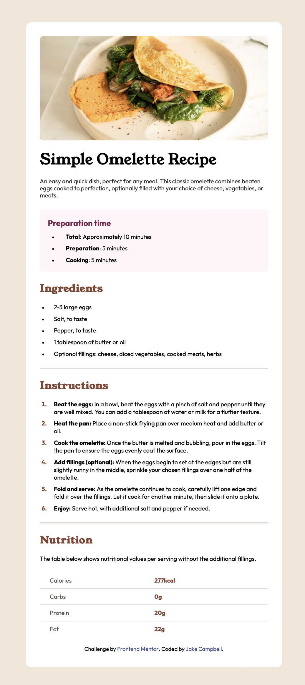

# Frontend Mentor - Recipe page solution

This is a solution to the [Recipe page challenge on Frontend Mentor](https://www.frontendmentor.io/challenges/recipe-page-KiTsR8QQKm). Frontend Mentor challenges help you improve your coding skills by building realistic projects.

## Table of contents

- [Overview](#overview)
  - [The challenge](#the-challenge)
  - [Screenshot](#screenshot)
  - [Links](#links)
- [My process](#my-process)
  - [Built with](#built-with)
  - [What I learned](#what-i-learned)
  - [Continued development](#continued-development)
- [Author](#author)

## Overview

### Screenshot



### Links

- Solution URL: https://github.com/Jake-Oz/recipe-page
- Live Site URL: https://recipe-page-lake-five.vercel.app

## My process

### Built with

- [Next.js](https://nextjs.org/) - React framework
- [Tailwind CSS](https://tailwindcss.com/) - For styles

### What I learned

For this project, I was keen to get into the SOLID discipline by creating components with a Single responsibility. As a result, my main Home page as defined in the Page.tsx file is easy to understand and matches the flow of the static page itself. Page.tsx is shown below:

```tsx
import RecipeImage from "./ui components/image";
import data from "@/recipeData";
import RecipeTitle from "./ui components/recipe_title";
import Preparation from "./ui components/preparation";
import Ingredients from "./ui components/ingredients";
import Instructions from "./ui components/instructions";
import Nutrition from "./ui components/nutrition";
import Attribution from "./ui components/attribution";

export default function Home() {
  return (
    <div className="mx-auto max-w-lg min-w-[200px] bg-neutral-white sm:my-16 rounded-xl sm:p-7">
      <RecipeImage src="/image-omelette.jpeg" alt="Recipe App" />
      <div className="sm:p-0 p-7">
        <RecipeTitle heading={data.title} paragraph={data.description} />
        <Preparation title="Preparation time" items={data.preparationTime} />
        <Ingredients ingredients={data.ingredients} />
        <hr className="my-5 border-neutral-lightGrey border-b-[1px]" /> <Instructions
          instructions={data.instructions}
        />
        <hr className="my-5 border-neutral-lightGrey border-b-[1px]" />{" "}
        <Nutrition data={data.nutrition} />
        <Attribution />
      </div>
    </div>
  );
}
```

I also just started using Github Copilot so was able to use that AI tool to speed up my workflow and finish this project in close to half the time.

### Continued development

I now want to use the principles and discipline I applied to this project in more complex projects moving forward.

## Author

- Frontend Mentor - [@Jake-Oz]https://www.frontendmentor.io/profile/Jake-Oz
